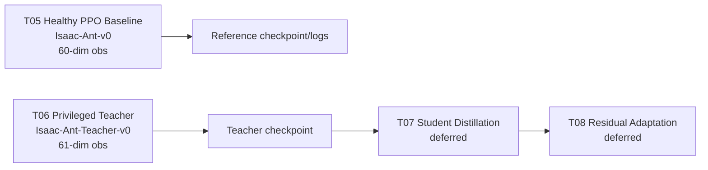

# RLM1 Stripped Flow Up To T06

## Current Conference-Stage Pipeline

The active conference-stage method is `RLM1 stripped`. The pipeline currently contains the verified T05 healthy PPO baseline and the T06 privileged teacher policy. Health token is OFF. The uncertainty channel and safety shield / CBF are not active.

T07 student distillation and T08 residual adaptation are conceptual future stages only; neither is implemented in the current flow.

## Stage Roles

- T05 Healthy PPO Baseline: trains the healthy Ant reference policy on `Isaac-Ant-v0` with a 60-dimensional `policy` observation and 8-dimensional joint effort action.
- T06 Privileged Teacher: trains the privileged Ant teacher on `Isaac-Ant-Teacher-v0` with a 61-dimensional `policy` observation and 8-dimensional joint effort action.
- T07 Student Distillation: deferred conceptual transition from the T06 teacher checkpoint to a non-privileged student.
- T08 Residual Adaptation: deferred conceptual transition after student distillation.

## Current Artifact Conventions

- T05 checkpoint pointer: `checkpoints/rlm1_stripped/healthy_baseline/none/seed0/latest_checkpoint.yaml`
- T06 checkpoint pointer: `checkpoints/rlm1_stripped/teacher/none/seed0/latest_checkpoint.yaml`

## Conceptual Transition Diagram

