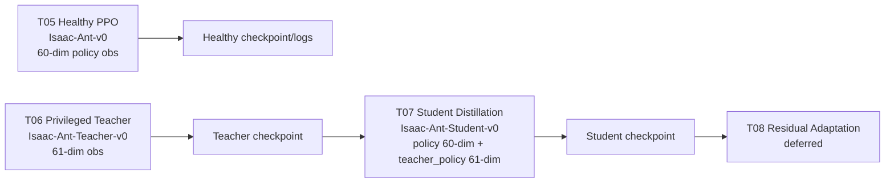

# RLM1 Stripped Flow Up To T07

## Current Conference-Stage Pipeline

The active conference-stage method is `RLM1 stripped`. The implemented flow now contains the T05 healthy PPO baseline, the T06 privileged teacher policy, and the T07 student distillation handoff. Health token is OFF. The uncertainty channel and safety shield / CBF are inactive. T08 residual adaptation and T09 ablations remain deferred.

## Stage Roles

- T05 Healthy PPO Baseline: trains the healthy Ant reference policy on `Isaac-Ant-v0` with a 60-dimensional `policy` observation and 8-dimensional joint effort action.
- T06 Privileged Teacher: trains the privileged Ant teacher on `Isaac-Ant-Teacher-v0` with a 61-dimensional privileged observation and 8-dimensional joint effort action.
- T07 Student Distillation: trains a student on `Isaac-Ant-Student-v0` using `policy` as the 60-dimensional student-safe input and `teacher_policy` as the 61-dimensional frozen-teacher input.
- T08 Residual Adaptation: deferred transition after student distillation.
- T09 Ablation: deferred paper-stage ablation expansion.

## Artifact Conventions

- T05 checkpoint pointer: `checkpoints/rlm1_stripped/healthy_baseline/none/seed0/latest_checkpoint.yaml`
- T06 checkpoint pointer: `checkpoints/rlm1_stripped/teacher/none/seed0/latest_checkpoint.yaml`
- T07 checkpoint pointer: `checkpoints/rlm1_stripped/student/none/seed0/latest_checkpoint.yaml`
- T07 log root: `logs/rsl_rl/student__rlm1_stripped__none/`

## Paper-Facing Interpretation

The RLM1 stripped conference pipeline now has a verified teacher-to-student transition. T05 provides the healthy PPO reference, T06 provides privileged teacher supervision, and T07 transfers that behavior into a history-capable student that acts without direct access to `true_fault_state`. The residual adaptation stage is intentionally not active in this snapshot.

## Flow Diagram

## Deferred Items

- T08 residual adaptation
- T09 ablation runners
- Health token
- Uncertainty channel
- Safety shield / CBF
- P1/P2/P3 expansion
