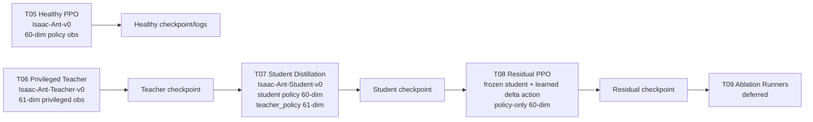

# RLM1 Stripped Flow Up To T08

## Current Conference-Stage Pipeline

The active conference-stage method is `RLM1 stripped`. The implemented flow now contains the T05 healthy PPO baseline, the T06 privileged teacher policy, the T07 student distillation handoff, and the T08 residual PPO layer. Health token is OFF. The uncertainty channel and safety shield / CBF are inactive. T09 ablation runners remain deferred.

## Stage Roles

- T05 Healthy PPO Baseline: trains the healthy Ant reference policy on `Isaac-Ant-v0` with a 60-dimensional `policy` observation and 8-dimensional joint effort action.
- T06 Privileged Teacher: trains the privileged Ant teacher on `Isaac-Ant-Teacher-v0` with a 61-dimensional privileged observation and 8-dimensional joint effort action.
- T07 Student Distillation: trains a history-capable student on `Isaac-Ant-Student-v0` using student-safe `policy` observations and privileged `teacher_policy` observations only for frozen-teacher supervision.
- T08 Residual PPO: freezes the T07 student, learns a residual delta action from the student-safe 60-dimensional `policy` group, and composes the final joint effort action.
- T09 Ablation: deferred paper-stage ablation expansion.

## Artifact Conventions

- T05 checkpoint pointer: `checkpoints/rlm1_stripped/healthy_baseline/none/seed0/latest_checkpoint.yaml`
- T06 checkpoint pointer: `checkpoints/rlm1_stripped/teacher/none/seed0/latest_checkpoint.yaml`
- T07 checkpoint pointer: `checkpoints/rlm1_stripped/student/none/seed0/latest_checkpoint.yaml`
- T08 checkpoint pointer: `checkpoints/rlm1_stripped/residual/none/seed0/latest_checkpoint.yaml`
- T08 log root: `logs/rsl_rl/residual__rlm1_stripped__none/`

## Paper-Facing Interpretation

The RLM1 stripped conference pipeline now has a verified healthy-to-teacher-to-student-to-residual path. T05 establishes the healthy PPO reference, T06 supplies privileged supervision, T07 transfers that behavior into a student that acts without direct `true_fault_state`, and T08 adds a policy-only residual correction layer on top of the frozen student. The method remains stripped: health token OFF, uncertainty inactive, and safety shield / CBF inactive.

## Flow Diagram

## Deferred Items

- T09 ablation runners
- Health token
- Uncertainty channel
- Safety shield / CBF
- P1/P2/P3 expansion
- Residual tuning beyond smoke
- Faulted residual curriculum
