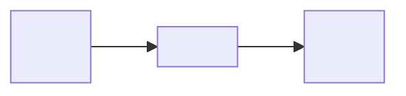

# Architecture Snapshot Template

Scope: `<conference-stage scope and method; health token status>`

## Stage Identity

- Stage: `<stage>`
- Task id: `<task_id>`
- Method: `<method>`
- Fault: `<fault>`

## Validation Source

- Runtime log: `<runtime_log_path_or_run_id>`
- Config file: `<config_file_path>`
- Checkpoint pointer: `<checkpoint_pointer_path>`

## Verified Interface

- Observation group: `<observation_group>`
- Observation terms:
  - `<term_name>`: `<shape_or_dimension>`
- Observation dimension: `<observation_dimension>`
- Action dimension: `<action_dimension>`

## Network Architecture

- Actor architecture: `<actor_architecture>`
- Critic architecture: `<critic_architecture>`
- RL backend: `<training_backend>`

## Log And Checkpoint Convention

- Log path: `<log_path>`
- Checkpoint path: `<checkpoint_path>`

## Paper-Facing Interpretation

`<Concise interpretation of what the policy receives, what it outputs, and how this stage fits into the paper-facing pipeline. Mark future or inactive components as deferred.>`

## Flow Diagram

