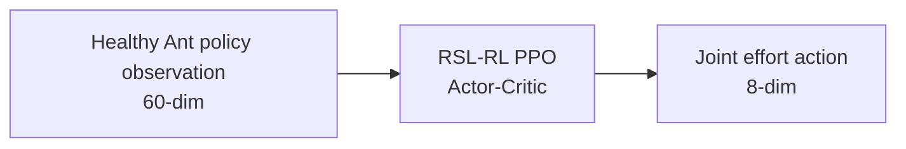

# T05 Healthy PPO Baseline Architecture Snapshot

Scope: Conference-stage RLM1 stripped; health token OFF.

## Stage Identity

- Stage: `healthy_baseline`
- Task id: `Isaac-Ant-v0`
- Method variant: `rlm1_stripped`
- Fault: `none`

## Verified Interface

- Observation group: `policy`
- Observation dimension: `60`
- Action dimension: `8`
- Action type: joint effort action

## Network Architecture

- Actor MLP: `60 -> 400 -> 200 -> 100 -> 8`
- Critic MLP: `60 -> 400 -> 200 -> 100 -> 1`
- RL backend: RSL-RL PPO actor-critic

## Log And Checkpoint Convention

- Log root: `logs/rsl_rl/healthy_baseline__rlm1_stripped__none/`
- Checkpoint pointer: `checkpoints/rlm1_stripped/healthy_baseline/none/seed0/latest_checkpoint.yaml`

## Interpretation

T05 is the healthy reference PPO baseline for the conference-stage Ant setup. The policy receives the standard 60-dimensional Ant policy observation and produces 8-dimensional joint effort actions, with no fault information, health token, uncertainty channel, or safety shield.

## Flow Diagram

