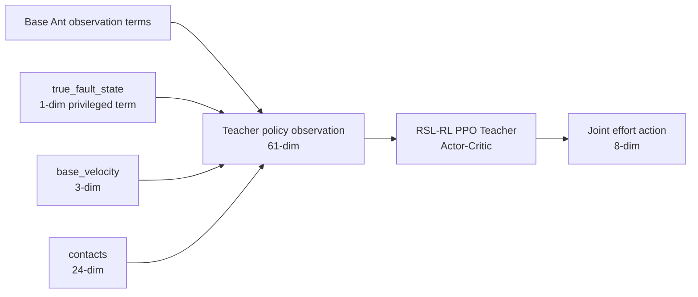

# T06 Privileged Teacher Architecture Snapshot

Scope: Conference-stage RLM1 stripped; health token OFF.

## Stage Identity

- Stage: `teacher`
- Task id: `Isaac-Ant-Teacher-v0`
- Method variant: `rlm1_stripped`
- Fault: `none`

## Verified Interface

- Observation group: `policy`
- Observation dimension: `61`
- Action dimension: `8`
- Action type: joint effort action

## Teacher-Specific Observation Terms

- `true_fault_state`: shape `(1,)`
- `base_velocity`: shape `(3,)`
- `contacts`: shape `(24,)`

## Network Architecture

- Actor MLP: `61 -> 400 -> 200 -> 100 -> 8`
- Critic MLP: `61 -> 400 -> 200 -> 100 -> 1`
- RL backend: RSL-RL PPO teacher actor-critic

## Log And Checkpoint Convention

- Log root: `logs/rsl_rl/teacher__rlm1_stripped__none/`
- Checkpoint pointer: `checkpoints/rlm1_stripped/teacher/none/seed0/latest_checkpoint.yaml`

## Interpretation

T06 trains a privileged teacher on the Ant teacher task. Compared with T05, the teacher policy receives a 61-dimensional policy observation that includes the Ant-local true fault state placeholder plus privileged base velocity and contact terms. The initial conference-stage default remains `fault: none`, with health token, uncertainty channel, safety shield, student, and residual logic inactive.

## Flow Diagram

