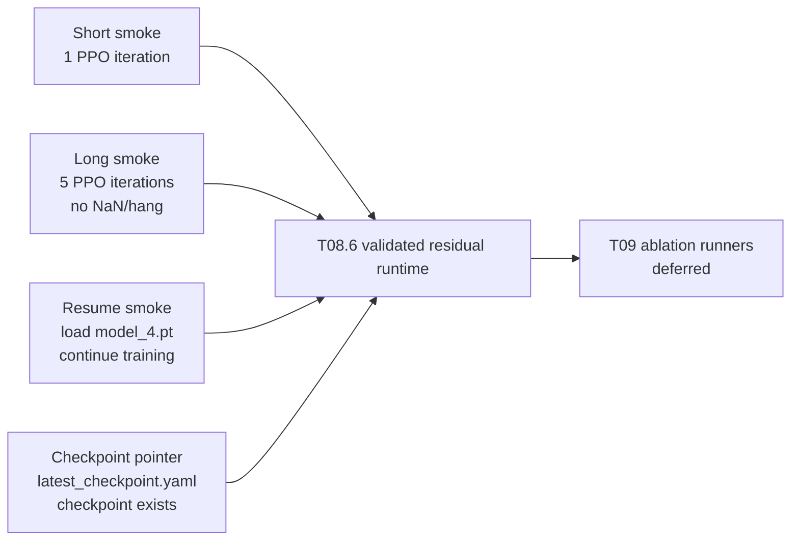

# T08 Residual Runtime Validation

Scope: Conference-stage RLM1 stripped; T08 residual runtime validation; health token OFF.

## Purpose

This note records the T08.6 runtime validation pass for the residual PPO pipeline. It documents that the stabilized residual runtime completed short, long, and resume smoke checks without changing the learning architecture, observation contract, or action composition semantics.

## Runtime Baseline Identity

- Task: `Isaac-Ant-Student-v0`
- Stage: `residual`
- Method variant: `rlm1_stripped`
- Fault: `none`
- Residual PPO actor observation: `policy` only, 60-dimensional
- Residual PPO critic observation: `policy` only, 60-dimensional
- Action dimension: `8`
- `teacher_policy`: exists in the environment but is unused by residual PPO
- `true_fault_state`: not used by residual PPO
- `residual_scale`: `0.1`
- `final_action_clip`: `None`
- `reset_hidden_on_done`: `False`
- Action composition:

```python
final_action = base_action + residual_scale * tanh(delta_action)
```

## Short Smoke Result

- Command: `TERM=xterm ./trainers/run_t08_residual_train.sh --headless --num_envs 8 --max_iterations 1`
- Result: passed
- Deterministic seed print appeared: `[INFO] T08.6 deterministic seed: 0`
- Runtime summary appeared
- Residual diagnostics appeared
- One residual PPO iteration completed
- Residual checkpoint pointer was written

## Long Smoke Result

- Command: `TERM=xterm ./trainers/run_t08_residual_long_smoke.sh`
- Result: passed
- Ran 5 PPO iterations: `Learning iteration 0/5` through `4/5`
- No NaN/Inf failure
- No hang
- Residual diagnostics appeared at each iteration
- Residual checkpoint pointer was written

## Resume Smoke Result

- Command: `TERM=xterm ./trainers/run_t08_residual_train.sh --headless --num_envs 8 --max_iterations 1 --resume`
- Result: passed
- Resume checkpoint resolved: `logs/rsl_rl/residual__rlm1_stripped__none/2026-05-28_17-47-04_residual__rlm1_stripped__none__seed0/model_4.pt`
- Training resumed from the residual checkpoint
- Residual diagnostics appeared
- Residual checkpoint pointer was written again

## Checkpoint Pointer Verification

- Residual checkpoint pointer: `checkpoints/rlm1_stripped/residual/none/seed0/latest_checkpoint.yaml`
- Pointer exists: `True`
- Checkpoint exists: `True`
- Checkpoint path: `logs/rsl_rl/residual__rlm1_stripped__none/2026-05-28_17-48-24_residual__rlm1_stripped__none__seed0/model_4.pt`

## Residual Diagnostics Recorded

- `Residual/mean_abs_delta`
- `Residual/max_abs_delta`
- `Residual/saturation_ratio`
- `Residual/clip_fraction`

T08.6 also prints a runtime summary and uses deterministic seed plumbing for Python `random`, NumPy, PyTorch, and CUDA when available. The long smoke helper is `trainers/run_t08_residual_long_smoke.sh`, and resume support uses the existing RSL-RL checkpoint loading path.

## NaN / Inf Guard Summary

T08.6 validates action tensors before stepping the environment. The runtime raises a clear error if any non-finite values appear in:

- `delta_action`
- `bounded_delta`
- `residual_action`
- `final_action`

The validation smokes completed without triggering these guards.

## Flow Diagram



## Validation Sources

- Runtime logs
- Checkpoint pointer
- Code inspection
- Smoke commands

## Remaining Deferred Items

- T09 ablation runners
- Health token
- Uncertainty channel
- Safety shield / CBF
- Privileged critic
- Recurrent residual PPO
- Faulted residual curriculum
- Residual tuning beyond smoke
