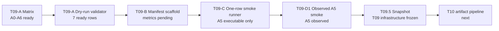

# T09 Conference Ablation Infrastructure Snapshot

Scope: Conference-stage RLM1 stripped; ablation infrastructure snapshot; no full sweep.

## T09 Stage Summary

- T09-A matrix ready: `configs/ablation/t09_conference_matrix.yaml` defines A0-A6.
- T09-A dry-run validator ready: `evaluators/run_t09_ablation_matrix.py` validates seven ready rows.
- T09-B manifest scaffold ready: `papers/conference/results/t09_ablation_manifest_template.md` records pending metric fields.
- T09-C one-row A5 smoke runner ready: `trainers/run_t09_ablation_smoke.sh` supports guarded A5 execution only.
- T09-D1 observed A5 smoke manifest ready: `papers/conference/results/t09_ablation_observed_smoke_manifest.md` records the observed A5 smoke.

## A0-A6 Matrix State

| ablation_id | name | current_status | execution_status | checkpoint_status | paper_role |
| --- | --- | --- | --- | --- | --- |
| A0 | healthy_ppo | ready | pending | ready | Healthy PPO baseline |
| A1 | privileged_teacher_reference | ready | pending | ready | Privileged teacher reference |
| A2 | student_distilled_no_residual | ready | pending | ready | Student without residual |
| A3 | student_residual_scale_0_0 | ready | pending | ready | Residual runtime control |
| A4 | student_residual_scale_0_05 | ready | pending | ready | Residual scale sensitivity |
| A5 | student_residual_scale_0_1 | A5 observed smoke passed | observed one-row smoke | ready | Default residual baseline |
| A6 | student_residual_scale_0_2 | ready | pending | ready | Residual scale sensitivity |

A5 observed smoke passed. A0, A1, A2, A3, A4, and A6 remain pending. Full sweeps are deferred. The full evaluation runner is deferred.

## A5 Observed Smoke Summary

| field | value |
| --- | --- |
| ablation_id | A5 |
| name | student_residual_scale_0_1 |
| stage | residual |
| task | Isaac-Ant-Student-v0 |
| residual_scale | 0.1 |
| actor obs | policy only |
| critic obs | policy only |
| uses_teacher_policy | False |
| uses_true_fault_state | False |
| policy_dim | 60 |
| action_dim | 8 |
| Learning iteration | 0/1 |
| Mean value loss | 0.0077 |
| Mean surrogate loss | -0.0138 |
| Mean entropy loss | 11.3543 |
| Mean reward | 0.07 |
| Mean episode length | 5.00 |
| Residual/mean_abs_delta | 0.0582 |
| Residual/max_abs_delta | 0.0982 |
| Residual/saturation_ratio | 0.0430 |
| Residual/clip_fraction | 0.0000 |
| NaN/Inf failure | not observed |
| hang | not observed |
| checkpoint pointer | `checkpoints/rlm1_stripped/residual/none/seed0/latest_checkpoint.yaml` |

## Artifact Map

- Matrix file: `configs/ablation/t09_conference_matrix.yaml`
- Dry-run validator: `evaluators/run_t09_ablation_matrix.py`
- Manifest collector: `evaluators/collect_t09_results.py`
- One-row smoke runner: `evaluators/run_t09_one_row_smoke.py`
- Smoke shell helper: `trainers/run_t09_ablation_smoke.sh`
- Ablation plan: `papers/conference/architecture/t09_ablation_plan.md`
- Smoke runner note: `papers/conference/architecture/t09_smoke_runner_note.md`
- Manifest template: `papers/conference/results/t09_ablation_manifest_template.md`
- Observed smoke manifest: `papers/conference/results/t09_ablation_observed_smoke_manifest.md`

## Infrastructure Flow

## Guardrails

- health token OFF.
- Uncertainty channel inactive.
- Safety shield / CBF inactive.
- No P1/P2/P3 expansion.
- No new methods beyond A0-A6.
- No full sweep has been run.
- No full evaluation runner has been implemented.
- A0/A1/A2/A3/A4/A6 are not marked observed.

## Deferred

- Full A0-A6 observed results.
- Evaluation runner.
- Faulted scenario evaluation.
- Multi-seed aggregation.
- Statistical summaries.
- Paper table export.
- Health token.
- Uncertainty channel.
- Safety shield / CBF.
- P1/P2/P3 expansion.
