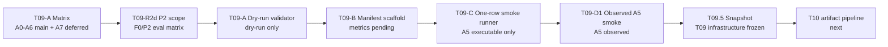

# T09 Conference Ablation Infrastructure Snapshot

Scope: Conference-stage RLM1 stripped; P2 single joint lock selected as main fault scope; ablation infrastructure snapshot; no full sweep.

## T09 Stage Summary

- T09-A matrix ready: `configs/ablation/t09_conference_matrix.yaml` defines main rows A0-A6.
- T09-R2c optional registration: A7 is documented as a deferred teacher-distilled residual ablation, not a main method row.
- T09-R2d scope pivot: `P2_locked_joint` is the main conference fault; P4 torque degradation is deferred to advisor-demo / thesis-extension artifacts.
- T09-R2d controlled-evaluation scope matrix ready: `configs/ablation/t09_p2_controlled_eval_matrix.yaml` defines future F0/P2 rows for A0, A2, A5, and optional A7.
- T09-A dry-run validator ready: `evaluators/run_t09_ablation_matrix.py` validates seven ready rows.
- T09-B manifest scaffold ready: `papers/conference/results/t09_ablation_manifest_template.md` records pending metric fields.
- T09-C one-row A5 smoke runner ready: `trainers/run_t09_ablation_smoke.sh` supports guarded A5 execution only.
- T09-D1 observed A5 smoke manifest ready: `papers/conference/results/t09_ablation_observed_smoke_manifest.md` records the observed A5 smoke.

## A0-A6 Matrix State

| ablation_id | name | current_status | execution_status | checkpoint_status | paper_role |
| --- | --- | --- | --- | --- | --- |
| A0 | healthy_ppo | ready | pending | ready | Healthy PPO baseline |
| A1 | p2_fault_aware_privileged_teacher_reference | scoped | pending | smoke/dev only | Future P2 privileged teacher reference |
| A2 | student_distilled_no_residual | scoped | pending | smoke/dev only | P2-distilled student without residual |
| A3 | student_residual_scale_0_0 | scoped | pending | smoke/dev only | P2 residual runtime control |
| A4 | student_residual_scale_0_05 | scoped | pending | smoke/dev only | P2 residual scale sensitivity |
| A5 | student_residual_scale_0_1 | scoped; old A5 smoke passed | pending canonical P2 run | smoke/dev only | Main P2 residual baseline |
| A6 | student_residual_scale_0_2 | scoped | pending | smoke/dev only | P2 residual scale sensitivity |

A5 observed smoke passed in earlier infrastructure validation, but that smoke is not a canonical P2 result. A0 canonical is ready; A1-F, A2, A3, A4, A5, and A6 remain blocked until P2-aligned canonical checkpoints and a guarded P2 evaluator exist. Full sweeps are deferred. The full evaluation runner is deferred.

## Optional A7 Deferred State

| ablation_id | name | current_status | execution_status | checkpoint_status | paper_role |
| --- | --- | --- | --- | --- | --- |
| A7 | healthy_ppo_teacher_distilled_residual | optional_deferred | not executable | no checkpoint expected | Optional residual-distillation ablation |

A7 is registered only to preserve the optional teacher-distilled residual idea.
It depends on A0 canonical, future A1-F P2 fault-aware teacher canonical, and a
future teacher-distilled residual checkpoint. It must not replace A5 without an
explicit later decision.

## P2 Conference Scope State

| field | value |
| --- | --- |
| main_fault_profile | `P2_locked_joint` |
| target_joint_default | `front_left_foot` |
| fault_onset_step_default | `50` |
| controlled_eval_matrix | `configs/ablation/t09_p2_controlled_eval_matrix.yaml` |
| scope_note | `papers/conference/results/t09_p2_single_joint_lock_scope.md` |
| runtime_status | P2 runtime evaluator deferred |

P2 single joint lock is the future conference fault scope. A0 trains healthy/no
fault only and is evaluated on F0/P2. Future A1-F, A2, A5, and optional A7
training or distillation should be P2-based. No P2 training or evaluation is
launched by this snapshot.

## P4 Deferred State

P4 torque degradation is no longer the main conference fault. Existing P4 smoke,
demo playback, quantitative logging, and plot artifacts remain archived as
advisor-demo infrastructure and thesis-extension material. They are not
paper-grade conference results.

## A5 Observed Smoke Summary

| field | value |
| --- | --- |
| ablation_id | A5 |
| name | student_residual_scale_0_1 |
| stage | residual |
| task | Isaac-Ant-Student-v0 |
| residual_scale | 0.1 |
| actor obs | policy only |
| critic obs | policy only |
| uses_teacher_policy | False |
| uses_true_fault_state | False |
| policy_dim | 60 |
| action_dim | 8 |
| Learning iteration | 0/1 |
| Mean value loss | 0.0077 |
| Mean surrogate loss | -0.0138 |
| Mean entropy loss | 11.3543 |
| Mean reward | 0.07 |
| Mean episode length | 5.00 |
| Residual/mean_abs_delta | 0.0582 |
| Residual/max_abs_delta | 0.0982 |
| Residual/saturation_ratio | 0.0430 |
| Residual/clip_fraction | 0.0000 |
| NaN/Inf failure | not observed |
| hang | not observed |
| checkpoint pointer | `checkpoints/rlm1_stripped/residual/none/seed0/latest_checkpoint.yaml` |

## Artifact Map

- Matrix file: `configs/ablation/t09_conference_matrix.yaml`
- P2 controlled-evaluation matrix: `configs/ablation/t09_p2_controlled_eval_matrix.yaml`
- Dry-run validator: `evaluators/run_t09_ablation_matrix.py`
- Manifest collector: `evaluators/collect_t09_results.py`
- One-row smoke runner: `evaluators/run_t09_one_row_smoke.py`
- Smoke shell helper: `trainers/run_t09_ablation_smoke.sh`
- Ablation plan: `papers/conference/architecture/t09_ablation_plan.md`
- P2 scope note: `papers/conference/results/t09_p2_single_joint_lock_scope.md`
- Smoke runner note: `papers/conference/architecture/t09_smoke_runner_note.md`
- Manifest template: `papers/conference/results/t09_ablation_manifest_template.md`
- Observed smoke manifest: `papers/conference/results/t09_ablation_observed_smoke_manifest.md`

## Infrastructure Flow

## Guardrails

- health token OFF.
- Uncertainty channel inactive.
- Safety shield / CBF inactive.
- P2 selected as the main future fault scope, but no P2 runtime execution has been launched.
- No P1/P3 expansion.
- No new methods beyond A0-A6, except the explicitly deferred optional A7 registration.
- No full sweep has been run.
- No full evaluation runner has been implemented.
- A0/A1/A2/A3/A4/A6 are not marked observed.
- P4 artifacts are deferred/demo only and are not conference main results.

## Deferred

- Full A0-A6 observed results.
- Evaluation runner.
- Faulted scenario evaluation.
- Multi-seed aggregation.
- Statistical summaries.
- Paper table export.
- Health token.
- Uncertainty channel.
- Safety shield / CBF.
- P1/P3 expansion.
- A7 implementation, training, checkpoint freeze, or evaluation.
- P2 runtime evaluator implementation and execution.
